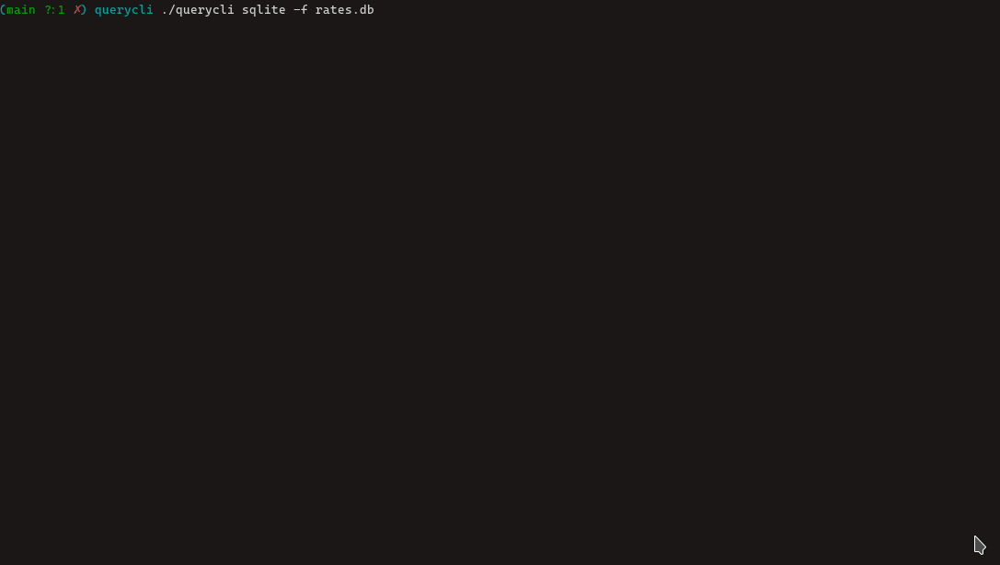

## querycli

Running sql in your CLI with a terminal UI. 


---

dependencies:

tui_widget
```
git clone https://github.com/jaar23/tui_widget.git

cd tui_widget && nimble install
```

db_connector
```
nimble install db_connector
```

sqlite devel lib on your machine

### Built it 

You will need nim to build this project. 

```shell
nimble build

# or

nim c -r src/querycli.nim
```
